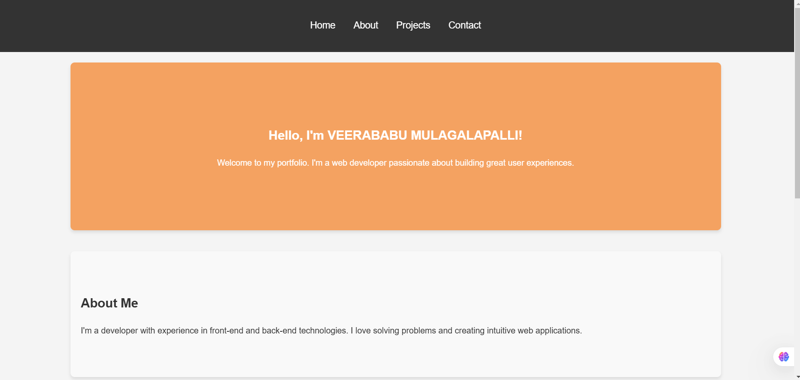

# Portfolio Webpage 🌐🧑‍💻🖥️

Welcome to my **Portfolio Webpage**! This project is a showcase of my skills, projects, and creativity as a web developer. It’s designed to provide a seamless and engaging experience for visitors while highlighting my expertise in modern web development.

---

## 🎥 Preview

---

## 🚀 Key Features

### **About Me**
- A brief introduction about myself, my background, and my passion for web development.
- A personal touch to connect with visitors.

### **Projects Section**
- A curated collection of my best projects with descriptions, technologies used, and live demo links.
- Each project is presented with a clean and visually appealing layout.

### **Skills & Technologies**
- A comprehensive list of my technical skills, including:
  - Frontend: HTML, CSS, JavaScript, React.js, etc.
  - Backend: Node.js, Express.js, etc.
  - Tools: Git, VS Code, Figma, etc.

### **Contact Me**
- A user-friendly contact form for easy communication.
- Links to my social media profiles (GitHub, LinkedIn, Twitter, etc.).

### **Responsive Design**
- Fully responsive layout that works seamlessly on desktop, tablet, and mobile devices.
- Smooth animations and transitions for an enhanced user experience.

---

## 🛠️ Technologies Used

- **Frontend**: HTML, CSS, JavaScript, React.js (or your preferred framework)
- **Backend**: Node.js, Express.js (optional, if applicable)
- **Deployment**: Netlify, Vercel, or any other hosting platform
- **Version Control**: Git and GitHub

---

## 📂 Project Structure
portfolio-webpage/
-├── public/ # Static assets (images, icons, etc.)
-├── src/ # Source code
-│ ├── components/ # Reusable UI components (Navbar, Footer, etc.)
-│ ├── pages/ # Application pages (Home, Projects, Contact, etc.)
-│ ├── styles/ # CSS or SCSS files
-│ └── App.js # Main application component
-├── README.md # Project documentation
-└── package.json # Dependencies and scripts

---

##💡 Why This Project?
This portfolio webpage is a reflection of my:

Technical Skills: Proficiency in frontend and backend technologies.

Design Sense: Ability to create visually appealing and user-friendly interfaces.

Professionalism: A well-organized and documented project that showcases my attention to detail.

📬 Contact Me
Have questions or want to collaborate? Feel free to reach out!

-📧 Email: veerababu.mulagalapalli@sasi.ac.in

-🌐 Portfolio: https://veerababu-2003.github.io/resume

-💼 LinkedIn: www.linkedin.com/in/veerababu-mulagalapalli-937228294

-🐙 GitHub: https://github.com/veerababu-2003/

Enjoy exploring my portfolio! Let’s connect and build something amazing together. 🚀
